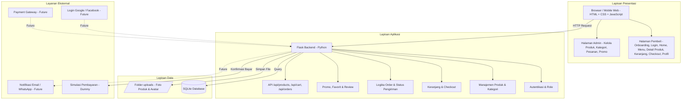
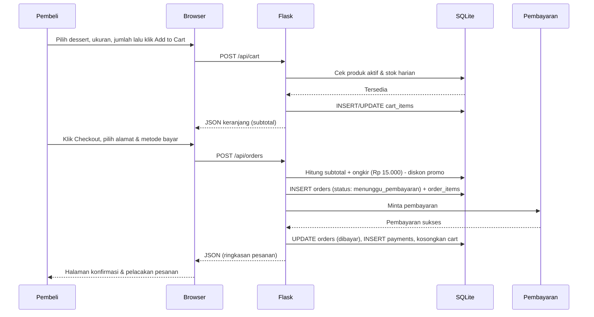
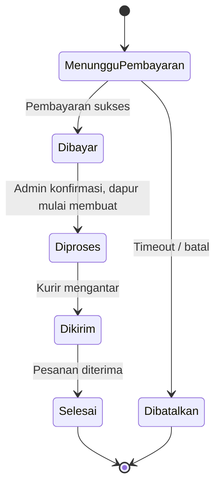
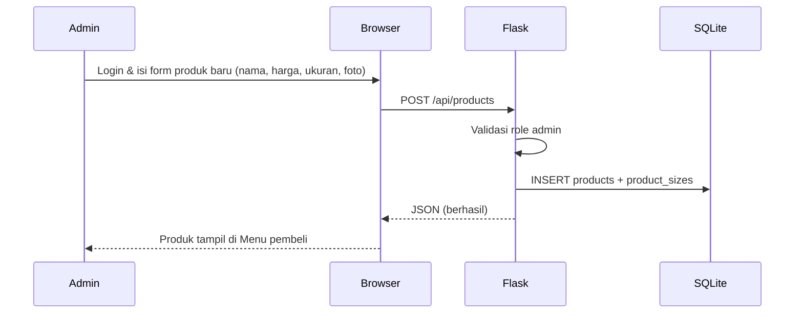
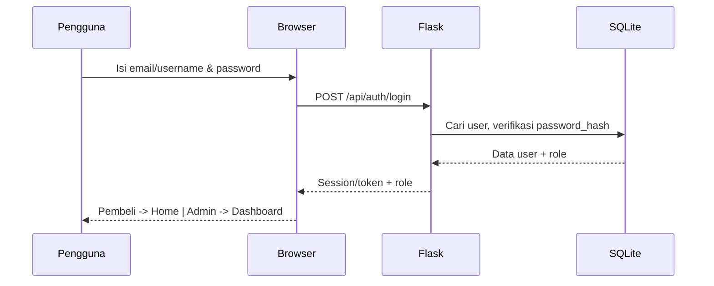
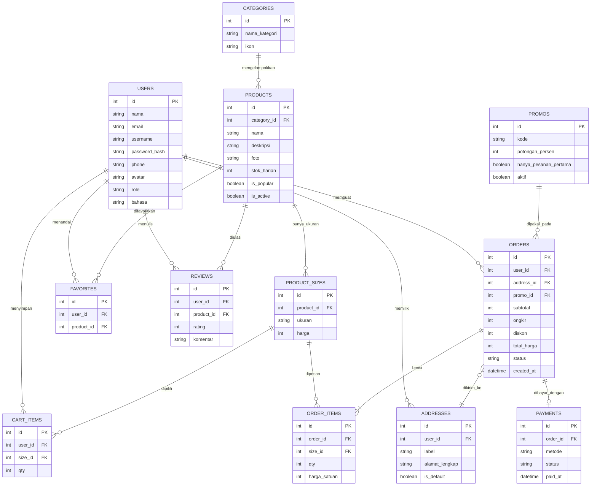

# ARSITEKTUR SISTEM — Crumella (Toko Cake & Dessert Online)

> *Sweet Moments, Better Days*

## 1. Diagram Arsitektur



## 2. Penjelasan Layer

| Layer | Komponen | Fungsi |
|-------|----------|--------|
| **Presentasi** | HTML, CSS, JavaScript | Menampilkan onboarding, katalog dessert, detail produk, keranjang, checkout, dan profil pembeli; dashboard admin |
| **Aplikasi** | Flask (Python) | Memproses request, autentikasi, hitung subtotal + ongkir, promo pesanan pertama, dan status pesanan |
| **Data** | SQLite + folder uploads | Menyimpan user, produk, ukuran, keranjang, pesanan, pembayaran, serta foto produk |
| **Layanan Eksternal** | Simulasi Pembayaran / Payment Gateway / OAuth | Konfirmasi pembayaran dan login sosial (tahap lanjutan) |

## 3. Pemetaan Halaman Desain ke Modul Sistem

| Halaman di Desain | Modul Backend | Endpoint Utama |
|-------------------|---------------|----------------|
| Splash & Onboarding (3 slide) | Statis (frontend) | - |
| Log In / Sign Up | Autentikasi | `POST /api/auth/login`, `POST /api/auth/register` |
| Home (search, kategori, Popular Menu) | Produk & Kategori | `GET /api/categories`, `GET /api/products?popular=1&q=` |
| Menu (Explore our menu) | Produk | `GET /api/products?q=&category=` |
| Detail Produk (rating, ukuran Reguler/Large, qty) | Produk, Review, Favorit | `GET /api/products/<id>`, `POST /api/favorites` |
| Your Sweet Cart | Keranjang | `GET/POST/PATCH/DELETE /api/cart` |
| Checkout (alamat, metode bayar, ringkasan) | Order & Pembayaran | `POST /api/orders`, `POST /api/payments` |
| Track Your Treat (pelacakan pesanan) | Order | `GET /api/orders/<id>/status` |
| Profil (Favourites, Language, Location, dll.) | User, Alamat, Favorit | `GET/PUT /api/profile`, `GET /api/favorites`, `GET/POST /api/addresses` |
| Edit Profile | User | `PUT /api/profile` |
| Log Out | Autentikasi | `POST /api/auth/logout` |

## 4. Alur Komunikasi

### 4.1 Alur Pemesanan Dessert



### 4.2 Alur Pelacakan Pesanan ("Track your treat")



### 4.3 Alur Admin Menambah Produk



### 4.4 Alur Login



## 5. Rancangan Tabel Database



**Catatan desain data:**
- `PRODUCT_SIZES` memisahkan harga per ukuran (Reguler / Large) agar satu dessert bisa punya dua harga.
- `ORDER_ITEMS.harga_satuan` menyimpan harga saat transaksi, sehingga riwayat tidak berubah jika harga produk diubah.
- Rating rata-rata (mis. 4.8 dari 120 review) dihitung dari tabel `REVIEWS`.
- Biaya ongkir awal diset tetap (Rp 15.000), bisa dikembangkan berdasarkan jarak.

## 6. Contoh Perhitungan Total Pesanan

```
subtotal = SUM(harga_satuan x qty)        -> Rp 107.000
ongkir   = 15.000                          -> Rp  15.000
diskon   = promo pesanan pertama (jika ada)
total    = subtotal + ongkir - diskon      -> Rp 122.000 (tanpa diskon)
```

## 7. Teknologi yang Digunakan

| Komponen | Teknologi | Alasan |
|----------|-----------|--------|
| Backend | Flask | Ringan, mudah dipelajari |
| Database | SQLite | Tanpa server, portable |
| Frontend | HTML + CSS + JavaScript | Sederhana, tampilan mobile-first sesuai desain |
| Font & Gaya | Poppins, palet maroon `#5C161B` & krem/peach | Konsisten dengan desain Crumella |
| Keamanan | Werkzeug (hash password) | Password tidak disimpan sebagai teks biasa |
| Pembayaran | Simulasi (dummy) | Bisa didemokan tanpa akun merchant |
| Login Sosial | Google & Facebook OAuth (tahap lanjutan) | Sesuai tombol di halaman Log In |
| Version Control | Git + GitHub | Standar industri |
| Diagram | Mermaid | Render langsung di GitHub |

## 8. Pembagian Fitur per Tahap

| Tahap | Fitur |
|-------|-------|
| **MVP** | Register/Login, katalog + pencarian, detail produk, keranjang, checkout dengan pembayaran simulasi, riwayat & status pesanan, dashboard admin |
| **Tahap 2** | Favorit, review & rating, promo pesanan pertama, multi-alamat, edit profil lengkap |
| **Tahap 3** | Login Google/Facebook, payment gateway (mis. Midtrans), notifikasi email/WhatsApp, langganan (Subscription), mode gelap |

## 9. Kelebihan Arsitektur Ini

- **Modular** - Setiap layer terpisah, mudah dikembangkan
- **Sesuai Desain** - Setiap layar Figma punya modul dan endpoint yang jelas
- **Tanpa Layanan Berbayar** - Berjalan penuh dengan simulasi pembayaran
- **Future-proof** - Siap integrasi payment gateway, OAuth, dan notifikasi
- **Aman** - Pemisahan role (pembeli/admin) dan password ter-hash
- **Ringan** - Tidak butuh server besar
