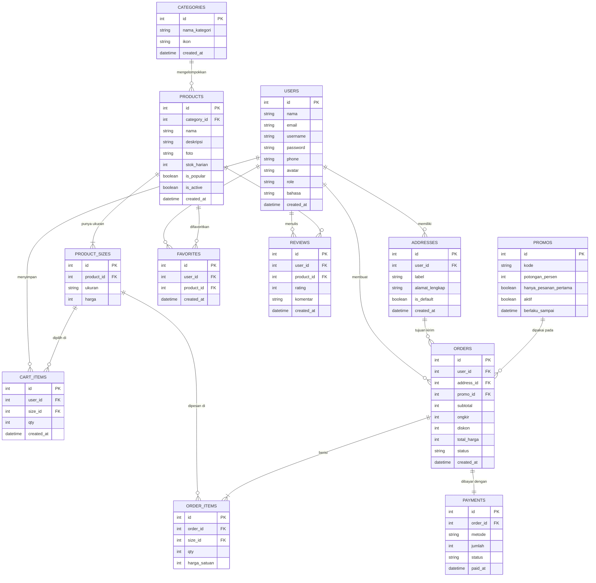

# ENTITY RELATIONSHIP DIAGRAM (ERD)
## Crumella — Toko Cake & Dessert Online

## 1. Diagram ERD

## 2. Detail Tabel

### Tabel: `users`
| Field | Tipe | Keterangan |
|-------|------|-----------|
| id | INTEGER | Primary Key, Auto Increment |
| nama | VARCHAR(100) | Nama lengkap, Not Null (mis. Raisa Salsabilla) |
| email | VARCHAR(100) | Unique, Not Null |
| username | VARCHAR(50) | Unique, Not Null |
| password | VARCHAR(255) | Hash, Not Null |
| phone | VARCHAR(20) | Nomor telepon, boleh kosong |
| avatar | VARCHAR(255) | Path foto profil, boleh kosong |
| role | VARCHAR(10) | `pembeli` atau `admin`, Default `pembeli` |
| bahasa | VARCHAR(5) | Pengaturan bahasa, Default `id` |
| created_at | DATETIME | Default CURRENT_TIMESTAMP |

### Tabel: `addresses`
| Field | Tipe | Keterangan |
|-------|------|-----------|
| id | INTEGER | Primary Key |
| user_id | INTEGER | Foreign Key ke users.id |
| label | VARCHAR(30) | Mis. Rumah, Kantor |
| alamat_lengkap | TEXT | Alamat pengiriman, Not Null |
| is_default | BOOLEAN | Alamat utama, Default 0 |
| created_at | DATETIME | Default CURRENT_TIMESTAMP |

### Tabel: `categories`
| Field | Tipe | Keterangan |
|-------|------|-----------|
| id | INTEGER | Primary Key |
| nama_kategori | VARCHAR(50) | Unique, Not Null (mis. Cake, Pastry, Pudding, Cookies) |
| ikon | VARCHAR(255) | Path ikon/gambar kategori (kotak kategori di Home) |
| created_at | DATETIME | Default CURRENT_TIMESTAMP |

### Tabel: `products`
| Field | Tipe | Keterangan |
|-------|------|-----------|
| id | INTEGER | Primary Key |
| category_id | INTEGER | Foreign Key ke categories.id |
| nama | VARCHAR(100) | Not Null (mis. Cloudy Choco Melt) |
| deskripsi | TEXT | Deskripsi dessert |
| foto | VARCHAR(255) | Path foto produk |
| stok_harian | INTEGER | Jumlah tersedia per hari, Default 0 |
| is_popular | BOOLEAN | Tampil di Popular Menu, Default 0 |
| is_active | BOOLEAN | Tampil di katalog, Default 1 |
| created_at | DATETIME | Default CURRENT_TIMESTAMP |

### Tabel: `product_sizes`
| Field | Tipe | Keterangan |
|-------|------|-----------|
| id | INTEGER | Primary Key |
| product_id | INTEGER | Foreign Key ke products.id |
| ukuran | VARCHAR(20) | `Reguler` atau `Large` |
| harga | INTEGER | Harga per ukuran dalam Rupiah (mis. 20000), Not Null |

> Kombinasi `product_id` + `ukuran` bersifat Unique.

### Tabel: `cart_items`
| Field | Tipe | Keterangan |
|-------|------|-----------|
| id | INTEGER | Primary Key |
| user_id | INTEGER | Foreign Key ke users.id |
| size_id | INTEGER | Foreign Key ke product_sizes.id |
| qty | INTEGER | Jumlah, Default 1, minimal 1 |
| created_at | DATETIME | Default CURRENT_TIMESTAMP |

> Kombinasi `user_id` + `size_id` bersifat Unique (item yang sama hanya menambah qty).

### Tabel: `favorites`
| Field | Tipe | Keterangan |
|-------|------|-----------|
| id | INTEGER | Primary Key |
| user_id | INTEGER | Foreign Key ke users.id |
| product_id | INTEGER | Foreign Key ke products.id |
| created_at | DATETIME | Default CURRENT_TIMESTAMP |

> Kombinasi `user_id` + `product_id` bersifat Unique.

### Tabel: `reviews`
| Field | Tipe | Keterangan |
|-------|------|-----------|
| id | INTEGER | Primary Key |
| user_id | INTEGER | Foreign Key ke users.id |
| product_id | INTEGER | Foreign Key ke products.id |
| rating | INTEGER | Nilai 1 sampai 5, Not Null |
| komentar | TEXT | Ulasan, boleh kosong |
| created_at | DATETIME | Default CURRENT_TIMESTAMP |

### Tabel: `promos`
| Field | Tipe | Keterangan |
|-------|------|-----------|
| id | INTEGER | Primary Key |
| kode | VARCHAR(30) | Unique, Not Null (mis. SWEETFIRST) |
| potongan_persen | INTEGER | Diskon dalam persen |
| hanya_pesanan_pertama | BOOLEAN | Berlaku untuk pesanan pertama saja, Default 0 |
| aktif | BOOLEAN | Default 1 |
| berlaku_sampai | DATETIME | Boleh kosong |

### Tabel: `orders`
| Field | Tipe | Keterangan |
|-------|------|-----------|
| id | INTEGER | Primary Key |
| user_id | INTEGER | Foreign Key ke users.id |
| address_id | INTEGER | Foreign Key ke addresses.id |
| promo_id | INTEGER | Foreign Key ke promos.id, boleh kosong |
| subtotal | INTEGER | Total harga item (Rupiah) |
| ongkir | INTEGER | Biaya pengiriman, Default 15000 |
| diskon | INTEGER | Potongan promo (Rupiah), Default 0 |
| total_harga | INTEGER | subtotal + ongkir - diskon |
| status | VARCHAR(20) | `menunggu_pembayaran`, `dibayar`, `diproses`, `dikirim`, `selesai`, atau `batal`, Default `menunggu_pembayaran` |
| created_at | DATETIME | Default CURRENT_TIMESTAMP |

### Tabel: `order_items`
| Field | Tipe | Keterangan |
|-------|------|-----------|
| id | INTEGER | Primary Key |
| order_id | INTEGER | Foreign Key ke orders.id |
| size_id | INTEGER | Foreign Key ke product_sizes.id |
| qty | INTEGER | Jumlah dipesan |
| harga_satuan | INTEGER | Harga saat transaksi (Rupiah), agar riwayat tidak berubah |

### Tabel: `payments`
| Field | Tipe | Keterangan |
|-------|------|-----------|
| id | INTEGER | Primary Key |
| order_id | INTEGER | Foreign Key ke orders.id, Unique |
| metode | VARCHAR(30) | Mis. Transfer Bank, E-Wallet, COD (simulasi) |
| jumlah | INTEGER | Nominal pembayaran (Rupiah) |
| status | VARCHAR(10) | `menunggu`, `sukses`, atau `gagal` |
| paid_at | DATETIME | Waktu pembayaran berhasil, boleh kosong |

## 3. Relasi Antar Tabel

| Relasi | Tipe | Keterangan |
|--------|------|-----------|
| users -> addresses | One to Many | 1 pengguna bisa menyimpan banyak alamat |
| users -> cart_items | One to Many | 1 pengguna punya banyak item di keranjang |
| users -> favorites | One to Many | 1 pengguna bisa memfavoritkan banyak produk |
| users -> reviews | One to Many | 1 pengguna bisa menulis banyak ulasan |
| users -> orders | One to Many | 1 pembeli bisa membuat banyak pesanan |
| categories -> products | One to Many | 1 kategori berisi banyak produk |
| products -> product_sizes | One to Many | 1 produk punya beberapa ukuran (Reguler, Large) |
| products -> favorites | One to Many | 1 produk bisa difavoritkan banyak pengguna |
| products -> reviews | One to Many | 1 produk punya banyak ulasan |
| product_sizes -> cart_items | One to Many | 1 varian ukuran bisa ada di banyak keranjang |
| product_sizes -> order_items | One to Many | 1 varian ukuran bisa ada di banyak pesanan |
| addresses -> orders | One to Many | 1 alamat bisa dipakai pada banyak pesanan |
| promos -> orders | One to Many | 1 promo bisa dipakai pada banyak pesanan (opsional) |
| orders -> order_items | One to Many | 1 pesanan berisi 1 atau lebih item |
| orders -> payments | One to One | 1 pesanan punya 1 data pembayaran |

## 4. Aturan Bisnis Penting

- **Rating produk** (mis. 4.8 dari 120 review) dihitung dari `AVG(reviews.rating)` dan `COUNT(reviews.id)`, tidak disimpan di tabel produk.
- **Subtotal keranjang** = jumlah `product_sizes.harga x cart_items.qty`; saat checkout disalin ke `order_items.harga_satuan`.
- **Total pesanan** = `subtotal + ongkir - diskon` (contoh: 107.000 + 15.000 = 122.000).
- **Promo pesanan pertama** hanya valid jika pengguna belum punya pesanan berstatus `dibayar` atau lebih.
- **Keranjang dikosongkan** setelah pembayaran berhasil.
- **Ulasan** hanya boleh ditulis pengguna yang pesanannya sudah `selesai`.
