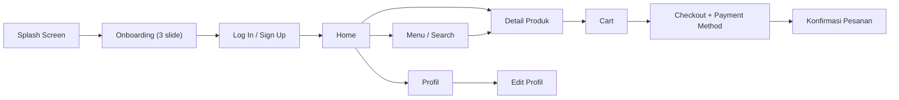

# RANCANGAN UX/UI — Website Crumella (Penjualan Cake & Dessert)

**Kelompok 7 · Informatika, Universitas Samudra · Agile/Scrum · Sprint 1**

Dokumen ini merangkum rancangan UX/UI Crumella berdasarkan desain Figma (`DESIGN_WEB.pdf`, 13 layar). Setiap wireframe di bawah mengikuti layar pada desain tersebut, dan ruang lingkupnya mengacu pada Charter: Splash Screen, Onboarding, Login / Sign Up, Home, Search Menu, Detail Produk, Checkout, Payment, dan Profil.

## 1. Tujuan Desain
Merancang antarmuka Crumella yang enak dilihat dan mudah dipakai, bahkan oleh pengguna baru, untuk menemukan cake dan dessert favorit, melihat detail produk, mengumpulkan beberapa pesanan di keranjang, lalu membayarnya sekaligus. Tampilan memakai nuansa cokelat marun dan krem yang hangat, dengan tombol besar berbentuk kapsul dan navigasi bawah yang selalu terlihat.

## 2. Identitas Visual

| Elemen | Isi |
|--------|-----|
| Nama & logo | Crumella (tulisan tangan/script dengan ikon cupcake berhias ceri) |
| Tagline | Sweet Moments, Better Days |
| Font isi | Poppins (judul tebal, teks isi reguler) |
| Bentuk | Sudut membulat, kartu putih lembut dengan bayangan tipis, tombol berbentuk kapsul |
| Ukuran layar rancangan | 390 x 844 (tampilan ponsel) |

## 3. User Flow

Alur utama sesuai Charter: **Buka Website → Login → Search Produk → Detail Produk → Checkout → Payment**.

### Alur Pembeli


Tombol **Skip** pada Onboarding langsung membawa pengguna ke halaman Log In / Sign Up. Navigasi bawah (Home, Menu, Cart, Profile) dapat dipakai dari halaman utama mana pun.

## 4. Wireframe Halaman

### A. Splash Screen

```
┌──────────────────────────────────────────┐
│                                          │
│                                          │
│                                          │
│                                          │
│                                          │
│             (cupcake + ceri)             │
│             C r u m e l l a              │
│                                          │
│        Sweet Moments, Better Days        │
│                                          │
│                                          │
│                                          │
│                                          │
│                                          │
└──────────────────────────────────────────┘
```

Latar belakang gradasi dari krem-peach di atas ke marun tua di bawah. Logo dan tagline berwarna krem di tengah.

### B. Onboarding (3 slide)

```
┌──────────────────────────────────────────┐
│                                          │
│   +----------------------------+         │
│   |                            |         │
│   |        (ilustrasi)         |         │
│   |                            |         │
│   +----------------------------+         │
│                                          │
│           Choose your dessert!           │
│      Temukan kue, pastry, dan aneka      │
│     camilan manis yang dibuat segar      │
│        setiap hari, cukup dengan         │
│             beberapa ketukan             │
│                                          │
│               [====]  o  o               │
│                                          │
│   [ Skip ]                [ Next ]       │
└──────────────────────────────────────────┘
```

| Slide | Judul | Teks |
|-------|-------|------|
| 1 | Choose your dessert! | Temukan kue, pastry, dan aneka camilan manis yang dibuat segar setiap hari, cukup dengan beberapa ketukan |
| 2 | Get a sweet offer! | Daftar hari ini dan nikmati diskon spesial untuk pesanan dessert pertamamu. |
| 3 | Track your treat! | Pantau pesananmu dari dapur kami sampai ke depan pintu, tetap segar dan tepat waktu |

Indikator titik di bawah menunjukkan slide yang aktif. Tombol **Skip** melewati Onboarding, tombol **Next** pindah ke slide berikutnya.

### C. Halaman Log In / Sign Up

```
┌──────────────────────────────────────────┐
│                                          │
│             (cupcake + ceri)             │
│             C r u m e l l a              │
│                                          │
│   ( Log In )         ( Sign Up )         │
│                                          │
│   Enter Email Or Username                │
│   ______________________________         │
│                                          │
│   Password                    (mata)     │
│   ______________________________         │
│                                          │
│   [          LOG IN          ]           │
│                                          │
│                    OR                    │
│                                          │
│                (f)   (G)                 │
│                                          │
│      Not Registered yet? Sign Up >       │
│                                          │
└──────────────────────────────────────────┘
```

Tab **Log In** aktif secara bawaan. Kolom password punya ikon mata untuk menampilkan/menyembunyikan isi. Tombol bulat Facebook dan Google adalah opsi login alternatif.

### D. Halaman Home

```
┌──────────────────────────────────────────┐
│   =                            (avatar)  │
│                                          │
│   Choose the                             │
│   Dessert you love                       │
│                                          │
│   ( (cari) Search for a dessert item )   │
│                                          │
│   +----------------------------+         │
│   |                            |         │
│   |         (banner)           |         │
│   +----------------------------+         │
│                                          │
│   Categories                             │
│   +------+ +------+ +------+ +------+    │
│   | Des- | | Cake | | Brow-| | Mi-  |    │
│   | sert | |      | | nies | | numan|    │
│   +------+ +------+ +------+ +------+    │
│                                          │
│   Popular Menu                           │
│   +--------+ +--------+ +--------+       │
│   | (foto) | | (foto) | | (foto) |       │
│   | nama   | | nama   | | nama   |       │
│   | harga  | | harga  | | harga  |       │
│   +--------+ +--------+ +--------+       │
├──────────────────────────────────────────┤
│   Home     Menu     Cart    Profile      │
└──────────────────────────────────────────┘
```

Empat kotak **Categories** diisi kategori dari Charter: Dessert, Cake, Brownies, dan Minuman. Foto pengguna di kanan atas membuka halaman Profil.

### E. Halaman Menu (Search Menu)

```
┌──────────────────────────────────────────┐
│                                          │
│   ( (cari) Search for pastries )         │
│                                          │
│   Explore our menu                       │
│   Something sweet is waiting for you     │
│                                          │
│   +----------------+ +----------------+  │
│   |     (foto)     | |     (foto)     |  │
│   |  nama / harga  | |  nama / harga  |  │
│   +----------------+ +----------------+  │
│   +----------------+ +----------------+  │
│   |     (foto)     | |     (foto)     |  │
│   |  nama / harga  | |  nama / harga  |  │
│   +----------------+ +----------------+  │
│   +----------------+ +----------------+  │
│   |     (foto)     | |     (foto)     |  │
│   |  nama / harga  | |  nama / harga  |  │
│   +----------------+ +----------------+  │
├──────────────────────────────────────────┤
│   Home     Menu     Cart    Profile      │
└──────────────────────────────────────────┘
```

Produk ditampilkan dalam grid dua kolom. Mengetuk salah satu kartu membuka halaman Detail Produk.

### F. Halaman Detail Produk

```
┌──────────────────────────────────────────┐
│   <-                                     │
│                                          │
│         (foto produk besar)              │
│                         (<3 favorit)     │
├──────────────────────────────────────────┤
│   Cloudy Choco Melt                      │
│   Rp 20.000                              │
│   (bintang) 4.8 (120 Review)             │
│                                          │
│   Dessert coklat lembut dengan           │
│   lelehan cokelat premium yang creamy.   │
│   Perpaduan manis dan rich-nya cocok     │
│   untuk menemani waktu santaimu.         │
│                                          │
│   Select Size                            │
│   +-------------+   +-------------+      │
│   | (o) Reguler |   |  ( ) Large  |      │
│   +-------------+   +-------------+      │
│                                          │
│   [ - ]  1  [ + ]                        │
│                                          │
│   [       ADD TO CART       ]            │
└──────────────────────────────────────────┘
```

Nama, harga, dan deskripsi di atas adalah contoh isi dari desain. Ukuran dipilih lewat dua tombol (Reguler / Large), jumlah diatur dengan tombol minus dan plus. Tombol besar di bagian bawah belum diberi label di Figma, diusulkan bertuliskan **Add to Cart**.

### G. Halaman Keranjang (Cart)

```
┌──────────────────────────────────────────┐
│   <-      Your sweet cart                │
│                                          │
│   +--------------------------------+     │
│   | (foto) |  nama produk        <3  |   │
│   +--------------------------------+     │
│   +--------------------------------+     │
│   | (foto) |  nama produk        <3  |   │
│   +--------------------------------+     │
│   +--------------------------------+     │
│   | (foto) |  nama produk        <3  |   │
│   +--------------------------------+     │
│   ------------------------------------   │
│   Subtotal                 Rp 107.000    │
│   Delivery                  Rp 15.000    │
│   ------------------------------------   │
│   Total                    Rp 122.000    │
│                                          │
│         [      CHECKOUT      ]           │
├──────────────────────────────────────────┤
│   Home     Menu     Cart    Profile      │
└──────────────────────────────────────────┘
```

Keranjang bisa berisi beberapa produk sekaligus. Angka pada gambar adalah contoh: subtotal Rp 107.000 + delivery Rp 15.000 = total Rp 122.000.

### H. Halaman Checkout & Payment Method

```
┌──────────────────────────────────────────┐
│   <-      Checkout                       │
│                                          │
│   Shipping Address                       │
│   +--------------------------------+     │
│   |  (alamat terpilih)             |     │
│   +--------------------------------+     │
│   +--------------------------------+     │
│   |  (alamat lain)                 |     │
│   +--------------------------------+     │
│                                          │
│   Payment Method                         │
│   ( (o) metode pembayaran 1        )     │
│   ( ( ) metode pembayaran 2        )     │
│   ( ( ) metode pembayaran 3        )     │
│                                          │
│   Order Summary                          │
│   +--------------------------------+     │
│   |  (ringkasan pesanan)           |     │
│   +--------------------------------+     │
│                                          │
│        [    CONFIRMATION    ]            │
├──────────────────────────────────────────┤
│   Home     Menu     Cart    Profile      │
└──────────────────────────────────────────┘
```

Pengguna memilih alamat pengiriman dan metode pembayaran, memeriksa ringkasan pesanan, lalu menekan **Confirmation**. Pada tahap awal, pembayaran memakai simulasi (dummy) sesuai dokumen arsitektur.

### I. Halaman Profil

```
┌──────────────────────────────────────────┐
│                                   (tema) │
│   (avatar)   Hi, Sweetie <3              │
│              Nama Pengguna               │
│              [ Edit Profile ]            │
│                                          │
│   +--------------------------------+     │
│   | <3  Favourites               > |     │
│   | v   Downloads                > |     │
│   | (o) Language                 > |     │
│   | (.) Location                 > |     │
│   | [=] Subscription             > |     │
│   | [x] Clear Cache              > |     │
│   | (<) Clear History            > |     │
│   | [->] Log Out                 > |     │
│   +--------------------------------+     │
│                                          │
│                  Logout                  │
├──────────────────────────────────────────┤
│   Home     Menu     Cart    Profile      │
└──────────────────────────────────────────┘
```

Tersedia dua versi pada desain: versi kedua lebih rapi (tanda panah sejajar) dan memiliki ikon pengaturan tema di kanan atas. Sebaiknya versi kedua yang dipakai.

### J. Halaman Edit Profil

```
┌──────────────────────────────────────────┐
│                                          │
│               Edit Profile               │
│                 (avatar)                 │
│                                          │
│   Name                                   │
│   [ ________________________ ]           │
│                                          │
│   E-mail address                         │
│   [ ________________________ ]           │
│                                          │
│   User Name                              │
│   [ ________________________ ]           │
│                                          │
│   Password                               │
│   [ ________________________ (x)]        │
│                                          │
│   Phone number                           │
│   [ ________________________ ]           │
│                                          │
├──────────────────────────────────────────┤
│   Home     Menu     Cart    Profile      │
└──────────────────────────────────────────┘
```

Kolom yang bisa diubah: nama, e-mail, username, password, dan nomor telepon.

### Usulan Halaman Tambahan (belum ada di Figma)

Dua halaman ini dibutuhkan agar alur Payment dan fitur pada Product Backlog lengkap. Wireframe di bawah hanya usulan awal.

#### K. Konfirmasi Pesanan

```
┌──────────────────────────────────────────┐
│                                          │
│             Order Confirmed              │
│                                          │
│   No. Pesanan : #CRM-0012                │
│   Status      : [ DIBAYAR ]              │
│                                          │
│   Ringkasan                              │
│   - Cloudy Choco Melt (Reguler) x1       │
│   - ...                                  │
│   Total       : Rp 122.000               │
│                                          │
│   [ Lihat Pesanan ]   [ Ke Home ]        │
│                                          │
└──────────────────────────────────────────┘
```

#### L. Riwayat & Status Pesanan

```
┌──────────────────────────────────────────┐
│   <-      Riwayat Pesanan                │
│                                          │
│   #CRM-0012  Rp 122.000  [Dibayar]       │
│   #CRM-0011  Rp  45.000  [Diproses]      │
│   #CRM-0009  Rp  60.000  [Selesai]       │
│   #CRM-0008  Rp  30.000  [Batal]         │
│                                          │
│   Ketuk pesanan untuk melihat            │
│   detail dan status pengiriman.          │
├──────────────────────────────────────────┤
│   Home     Menu     Cart    Profile      │
└──────────────────────────────────────────┘
```

## 5. Palet Warna & Indikator

Warna utama diambil dari desain Figma (nilai hex adalah hasil pembacaan dari file desain, jadi bisa berbeda tipis dari nilai aslinya di Figma).

| Elemen | Warna | Kode | Dipakai untuk |
|--------|-------|------|---------------|
| Marun tua | Cokelat marun | #5B161D | Tombol utama, kotak gambar/banner, ikon navigasi |
| Merah tua | Merah bata gelap | #650C03 | Latar foto Detail Produk, tombol Checkout, ikon aktif |
| Krem | Krem muda | #FFF2E6 | Latar halaman (bagian atas gradasi) |
| Peach | Peach lembut | #F9E3CF | Latar halaman (bagian bawah gradasi) |
| Putih hangat | Putih kemerahan | #FFFBFB | Kartu produk, kolom pencarian, tombol Skip/Next |
| Beige | Cokelat muda abu | #D3BFB2 | Kartu alamat tidak terpilih, kotak ringkasan pesanan |
| Splash | Gradasi peach ke marun | #F3CAAE → #59131B | Latar Splash Screen |

Indikator status pesanan (usulan, belum ada di desain):

| Kondisi | Warna | Kode | Keterangan |
|---------|-------|------|------------|
| Dibayar / Selesai | Hijau | #28A745 | Pembayaran berhasil / pesanan selesai |
| Pending / Diproses | Kuning | #FFC107 | Menunggu pembayaran / sedang dibuat |
| Batal / Habis | Merah | #DC3545 | Pesanan dibatalkan / produk habis |

## 6. Komponen UI Utama

| Komponen | Fungsi |
|----------|--------|
| Splash Screen | Menampilkan logo dan tagline Crumella saat website dibuka |
| Slider Onboarding | Tiga slide pengenalan dengan indikator titik, tombol Skip dan Next |
| Tab Log In / Sign Up | Berpindah antara masuk dan daftar akun |
| Kolom Input | Mengisi email/username dan password (dengan ikon mata) |
| Search Bar | Mencari dessert atau pastry berdasarkan nama |
| Banner Promo | Menampilkan penawaran atau produk unggulan di Home |
| Kotak Kategori | Memilih kategori Dessert, Cake, Brownies, atau Minuman |
| Card Produk | Menampilkan foto, nama, dan harga produk |
| Navigasi Bawah | Berpindah antara Home, Menu, Cart, dan Profile |
| Pemilih Ukuran | Memilih ukuran Reguler atau Large |
| Tombol Jumlah | Menambah atau mengurangi jumlah produk |
| Tombol Favorit (hati) | Menyimpan produk ke daftar favorit |
| Card Item Keranjang | Menampilkan produk di keranjang beserta tombol favorit |
| Ringkasan Biaya | Subtotal, biaya Delivery, dan Total |
| Card Alamat | Memilih alamat pengiriman |
| Pilihan Metode Bayar | Memilih metode pembayaran (simulasi) |
| Daftar Menu Profil | Menu Favourites, Language, Location, dan pengaturan akun |
| Form Edit Profil | Mengubah nama, e-mail, username, password, dan nomor telepon |

## 7. Kesesuaian dengan Charter & Catatan Desain

### 7.1 Kesesuaian dengan Ruang Lingkup Charter

| Ruang Lingkup Charter | Layar di Figma | Status |
|-----------------------|----------------|--------|
| Logo Crumella (Splash Screen) | A. Splash Screen | Sudah ada |
| Onboarding | B. Onboarding (3 slide) | Sudah ada |
| Login / Sign Up | C. Log In / Sign Up | Log In sudah ada, form Sign Up belum |
| Home | D. Home | Sudah ada |
| Search Menu | E. Menu, serta search bar di Home | Sudah ada |
| Detail Produk | F. Detail Produk | Sudah ada |
| Checkout | G. Cart dan H. Checkout | Sudah ada |
| Payment | Pilihan metode bayar di H. Checkout | Halaman konfirmasi belum ada (usulan K) |
| Profil | I. Profil dan J. Edit Profil | Sudah ada |

### 7.2 Hal yang Belum Ada di Figma
- Form **Sign Up** (tab Sign Up sudah ada, tetapi isinya belum dirancang).
- Halaman **konfirmasi pesanan** dan **riwayat/status pesanan**. Padahal slide Onboarding ketiga (Track your treat!) menjanjikan pemantauan pesanan.
- Label tombol besar di Detail Produk dan gambar produk yang masih berupa kotak kosong.

### 7.2b Fitur di Desain yang Belum Tercakup di Dokumen Lain
- Login lewat **Facebook/Google**, **favorit** (ikon hati), **rating & review** (4.8 dari 120 review), **biaya delivery**, dan **diskon pesanan pertama** belum ada di perhitungan Function Point maupun rancangan database (ERD). Tim perlu memutuskan apakah fitur ini dipakai atau dihapus dari desain.
- Menu Profil **Downloads**, **Subscription**, **Clear Cache**, dan **Clear History** tampaknya berasal dari template aplikasi lain dan tidak berkaitan dengan toko dessert. Diusulkan diganti dengan **Riwayat Pesanan** dan **Alamat Saya**.

### 7.3 Koreksi Penulisan pada Desain
Beberapa teks di Figma masih salah ketik. Di dokumen ini sudah dikoreksi, sebaiknya Figma juga diperbaiki.

| Teks di Figma | Seharusnya |
|---------------|------------|
| Chosee your dessert! | Choose your dessert! |
| diskon special untuk prsanan | diskon spesial untuk pesanan |
| sampai ke depan pint | sampai ke depan pintu |
| Paassword | Password |
| Not Regisrated yet? | Not Registered yet? |
| Something sweet is waiting you | Something sweet is waiting for you |
| Select Sice | Select Size |
| RP 20.0000 | Rp 20.000 |
| Chekout | Checkout |
| Shipping Adress | Shipping Address |
| Order Sumarry | Order Summary |
| Clear Cashe | Clear Cache |
