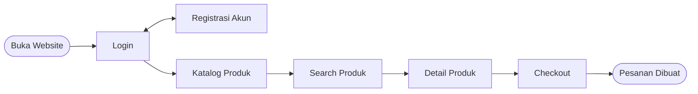

# 🧁 Proposal Proyek – Crumella

> Website Penjualan Cake & Dessert

| Keterangan | Isi |
| --- | --- |
| Nama Proyek | Crumella |
| Jenis Proyek | Website Penjualan Cake & Dessert |
| Metode Pengembangan | Agile/Scrum |
| Sprint Saat Ini | Sprint 1 |
| Program Studi | Informatika, Universitas Samudra |
| Kelompok | Kelompok 7 |

---

## Daftar Isi

1. [Latar Belakang](#1-latar-belakang)
2. [Tujuan](#2-tujuan)
3. [Keputusan Sprint 1](#3-keputusan-sprint-1)
4. [Arsitektur Sistem](#4-arsitektur-sistem)
5. [Tech Stack](#5-tech-stack-rencana-awal)
6. [Rencana Sprint](#6-rencana-sprint)
7. [Anggota Tim](#7-anggota-tim)
8. [Indikator Keberhasilan](#8-indikator-keberhasilan)

---

## 1. Latar Belakang

Membeli makanan lewat internet semakin diminati karena praktis, dan **cake/dessert** sering dicari untuk ulang tahun atau acara keluarga. Namun, pembeli sering bingung memilih rasa, harga, dan tampilan produk, lalu harus bertanya satu per satu ke penjual.

**Crumella** dibuat sebagai website untuk melihat, membaca detail, dan memesan cake/dessert dengan mudah.

## 2. Tujuan

- Membantu pembeli menemukan cake dan dessert favorit tanpa harus repot mencari
- Menampilkan rasa, harga, dan tampilan setiap produk secara lengkap
- Mempercepat pemesanan, mulai dari memilih produk sampai membayar
- Memungkinkan pembeli mengumpulkan beberapa pesanan di keranjang, lalu membayarnya sekaligus
- Menghadirkan website yang enak dilihat dan mudah dipakai, bahkan oleh pengguna baru
- Ruang lingkup produk dibatasi pada tiga kategori:
  - **Cake**
  - **Cupcake**
  - **Brownies**

**Target pengguna:** semua kalangan, kecuali anak di bawah umur.

## 3. Keputusan Sprint 1

### a. Agile Methodology

- Metodologi yang digunakan: **Scrum**
- Durasi sprint: ± 1 bulan per sprint (mengikuti timeline Sp1–Sp5)
- Role tim: 1 orang sebagai **Scrum Master** (koordinator), sisanya **Development Team**
- Tools tracking task: **GitHub Projects**
- Fokus Sprint 1: perancangan UX/UI, perencanaan sistem, dan struktur website

### b. UX Design

- Antarmuka dirancang di **Figma** sebelum masuk development
- Elemen utama halaman:
  - **Beranda:** pilihan kategori (Cake / Cupcake / Brownies), produk unggulan, dan pencarian
  - **Semua Menu & Kategori:** daftar produk dengan pencarian dan filter kategori
  - **Detail produk:** foto, rasa, harga, deskripsi, tombol tambah ke keranjang dan simpan ke favorit
  - **Keranjang & Checkout:** ringkasan pesanan dan pembayaran sekaligus
  - **Notifikasi:** status pesanan (contoh: banner "Pesanan berhasil dibuat")
  - **Pendukung:** Cara pesanan, Favorit/Simpan, Bantuan, Profil/Tentang, Pengaturan akun
- Alur pengguna:



### c. Project Setup

- Struktur folder awal repository:

```text
crumella/
├── backend/        # API server (Flask/Node.js)
├── frontend/       # Halaman web (HTML/JS/CSS)
├── database/       # Skema & seed data dummy
├── docs/           # Project charter, Figma, flowchart, ERD, arsitektur
└── README.md
```

- Tech stack awal: Python Dummy Data Generator (data produk contoh), Flask/Node.js (backend), HTML/JS + Bootstrap/Tailwind (frontend awal)

## 4. Arsitektur Sistem

### a. Pengguna & Peran

| Peran | Tugas |
| --- | --- |
| **Pembeli** | Registrasi, login, mencari produk, menyimpan favorit, mengisi keranjang, checkout, dan memantau pesanan |
| **Admin** | Mengelola produk dan kategori, mengelola pesanan, serta memantau notifikasi |

### b. Sistem Website (Representasi Digital)

- **Frontend web:** beranda, katalog, detail produk, keranjang, checkout, favorit, notifikasi, profil, dan bantuan
- **Backend REST API:** autentikasi, manajemen produk, keranjang, pesanan, favorit, dan notifikasi
- **Database:** tabel `users`, `categories`, `products`, `carts`, `favorites`, `orders`, `order_details`, `notifications`
- **Opsi data awal (tanpa data nyata):** Dummy Data Generator berbasis Python untuk mengisi katalog Cake, Cupcake, dan Brownies pada tahap pengembangan

### c. Fitur Tambahan (Rencana)

- Favorit/Simpan produk
- Notifikasi otomatis untuk status pesanan
- Halaman Cara Pesanan dan Bantuan untuk pengguna baru

### d. Catatan Risiko

- **Ketersediaan produk:** cake/dessert bersifat mudah habis dan berbatas waktu, sehingga stok perlu dikelola dengan jelas
- **Keamanan data:** data akun pengguna disimpan aman dan kata sandi dienkripsi
- **Kemudahan penggunaan:** pengguna baru harus bisa memahami alur tanpa bantuan, sehingga perlu diuji pada desain Figma
- **Pembatasan pengguna:** website ditujukan untuk semua kalangan kecuali anak di bawah umur

## 5. Tech Stack (Rencana Awal)

| Komponen | Teknologi |
| --- | --- |
| Sumber Data | Python Dummy Data Generator / input admin via form |
| Backend | (isi sesuai kesepakatan tim, contoh: Node.js/Express atau Flask) |
| Database | (contoh: MySQL/PostgreSQL/Firebase) |
| Frontend | HTML + JS + Bootstrap/Tailwind (atau React) |
| Desain | Figma |
| Pembayaran | Metode pembayaran pada Checkout (contoh: payment gateway sandbox Midtrans/Xendit) |
| Komunikasi | HTTP REST API |

## 6. Rencana Sprint

| Sprint | Bulan | Fokus |
| --- | --- | --- |
| Sp1 | September | Project charter, arsitektur & tech stack, desain UX/UI di Figma, setup repo |
| Sp2 | October | Backend (autentikasi, CRUD produk & kategori) + halaman beranda, katalog, dan detail produk |
| Sp3 | November | Keranjang, checkout & pembayaran, favorit, notifikasi, refinement |
| Sp4 | December | Testing, dashboard admin, profil & pengaturan akun, upgrade tampilan |
| Sp5 | December | Final testing, bug fixing, persiapan demo Expo |

## 7. Anggota Tim

| Nama | NIM | Tugas di Crumella |
| --- | --- | --- |
| Raisa Salsabilla | 250504002 | Desain Figma, UX/UI |
| Faradilatul Najwa | 250504015 | Menyusun dokumen dan rencana kerja |
| Yuwan Shabrina | 250504026 | Merancang sistem dan fitur website |

## 8. Indikator Keberhasilan

Proyek Crumella dianggap berhasil jika:

- [ ] Semua fitur utama sudah dirancang
- [ ] Pengguna baru dapat memahami alur dari produk
- [ ] Desain Figma lengkap
- [ ] Anggota dapat menyelesaikan tugas
- [ ] Hasil rancangan dari sprint bisa langsung dipakai
