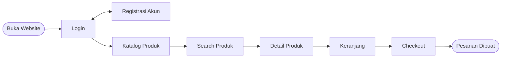

<!-- ============================================================
  PROFILE README - CRUMELLA (KELOMPOK 7)
  Tema: Peach & Maroon, sesuai desain Figma Crumella
  Cara pakai:
  1. Buat repository publik dengan nama SAMA PERSIS dengan username/organisasi GitHub kalian
  2. Simpan file ini sebagai README.md di repository tersebut
  3. Ganti semua teks USERNAME, USERNAME1-3, REPO1-3, dan data yang masih [ ... ]
  Catatan: cukup satu file ini saja. Semua animasi jalan otomatis di GitHub.
============================================================= -->

 

 

 

 

<table>
  <tr>
    <td align="center" width="33%">
       
       
       
       
       
       
       
       
      
    </td>
    <td align="center" width="33%">
       
       
       
       
       
       
       
       
      
    </td>
    <td align="center" width="33%">
       
       
       
       
       
       
       
       
      
    </td>
  </tr>
</table>

 

 

 

 

 

| Layar | Isi Halaman |
| :---: | :--- |
| **Splash** | Logo Crumella dan tagline *Sweet Moments, Better Days* |
| **Onboarding** | 3 slide: *Choose your dessert*, *Get a sweet offer*, *Track your treat* |
| **Log In / Sign Up** | Email/username, password, login lewat Facebook dan Google |
| **Home** | Pencarian, banner, kategori, dan Popular Menu |
| **Menu** | Pencarian pastry dan grid produk |
| **Detail Produk** | Foto, harga, rating, deskripsi, pilihan ukuran, jumlah, favorit |
| **Cart** | Daftar item, subtotal, ongkir, total, tombol Checkout |
| **Checkout** | Alamat pengiriman, metode pembayaran, ringkasan pesanan, konfirmasi |
| **Profile** | Favourites, bahasa, lokasi, langganan, hapus cache/riwayat, logout |
| **Edit Profile** | Nama, e-mail, username, password, nomor telepon |

 

 

 

 
 
 
 
 

 

 

 

 

