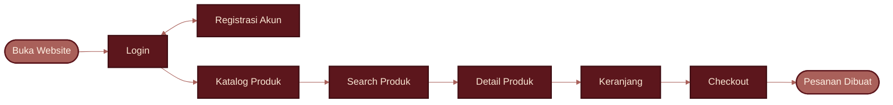

 

  

 

 

 

  

 

 

<table>
  <tr>
    <td align="center" width="200">
      
    </td>
    <td align="left">
       
      
      
       
      
       
       
      
    </td>
  </tr>
  <tr>
    <td align="center" width="200">
      
    </td>
    <td align="left">
       
      
      
       
      
       
       
      
    </td>
  </tr>
  <tr>
    <td align="center" width="200">
      
    </td>
    <td align="left">
       
      
      
       
      
       
       
      
    </td>
  </tr>
</table>

 

  

 

  

<table>
  <tr>
    <td align="center" width="110"> <b>Figma</b></td>
    <td align="center" width="110"> <b>HTML5</b></td>
    <td align="center" width="110"> <b>CSS3</b></td>
    <td align="center" width="110"> <b>JavaScript</b></td>
    <td align="center" width="110"> <b>Bootstrap</b></td>
  </tr>
  <tr>
    <td align="center" width="110"> <b>Node.js</b></td>
    <td align="center" width="110"> <b>Python</b></td>
    <td align="center" width="110"> <b>MySQL</b></td>
    <td align="center" width="110"> <b>Git</b></td>
    <td align="center" width="110"> <b>GitHub</b></td>
  </tr>
</table>

  

 

 

 

 

| Layar | Isi Halaman |
| :---: | :--- |
| **Splash** | Logo Crumella dan tagline *Sweet Moments, Better Days* |
| **Onboarding** | 3 slide: *Choose your dessert*, *Get a sweet offer*, *Track your treat* |
| **Log In / Sign Up** | Email/username, password, login lewat Facebook dan Google |
| **Home** | Pencarian, banner, kategori, dan Popular Menu |
| **Menu** | Pencarian pastry dan grid produk |
| **Detail Produk** | Foto, harga, rating, deskripsi, pilihan ukuran, jumlah, favorit |
| **Cart** | Daftar item, subtotal, ongkir, total, tombol Checkout |
| **Checkout** | Alamat pengiriman, metode pembayaran, ringkasan pesanan, konfirmasi |
| **Profile** | Favourites, bahasa, lokasi, langganan, hapus cache/riwayat, logout |
| **Edit Profile** | Nama, e-mail, username, password, nomor telepon |

  

 

  

| Sprint 1 | Sprint 2 | Sprint 3 | Sprint 4 | Sprint 5 |
| :---: | :---: | :---: | :---: | :---: |
|  |  |  |  |  |

 

  

 

  

| 01 | 02 | 03 | 04 | 05 | 06 |
| :---: | :---: | :---: | :---: | :---: | :---: |
| **Kebutuhan ✔** | **Rancangan • sedang berjalan** | Codingan | Testing | Rilis | Perawatan |

  

 

 

  

 

  

 

 

